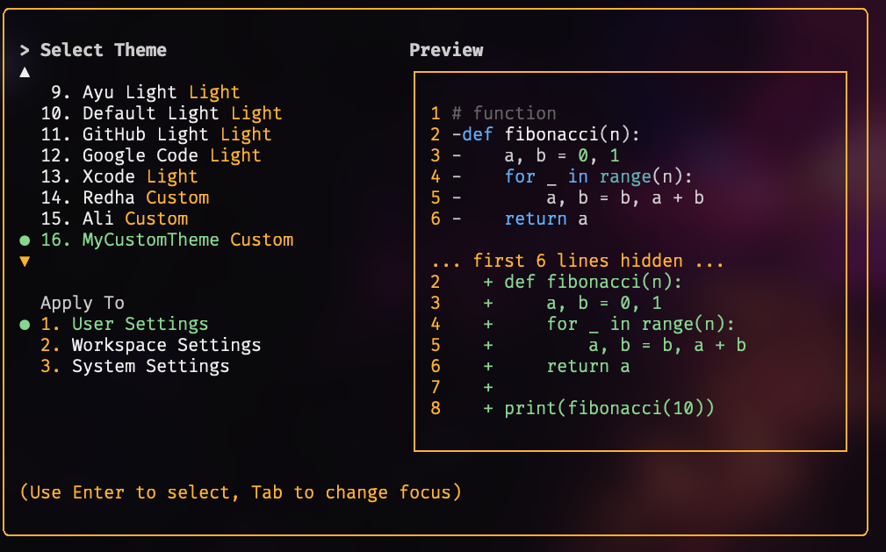

# 主題（Themes）

Gemini CLI 支援多種主題，可自訂其配色方案與外觀。你可以透過 `/theme` 指令或 `"theme":` 設定來變更主題，以符合你的個人偏好。

## 可用主題

Gemini CLI 提供多種預設主題，你可以在 Gemini CLI 中使用 `/theme` 指令來列出所有可用主題：

- **深色主題（Dark Themes）：**
  - `ANSI`
  - `Atom One`
  - `Ayu`
  - `Default`
  - `Dracula`
  - `GitHub`
- **淺色主題（Light Themes）：**
  - `ANSI Light`
  - `Ayu Light`
  - `Default Light`
  - `GitHub Light`
  - `Google Code`
  - `Xcode`

### 變更主題

1. 在 Gemini CLI 輸入 `/theme`。
2. 會出現一個對話框或選擇提示，列出所有可用主題。
3. 使用方向鍵選擇主題。有些介面可能會在選擇時即時預覽或高亮顯示主題。
4. 確認你的選擇以套用主題。

**注意：** 如果你的 `settings.json` 檔案中已定義主題（不論是以名稱或檔案路徑），你必須先將 `"theme"` 設定從該檔案中移除，才能使用 `/theme` 指令變更主題。

### 主題持久性

所選主題會儲存在 Gemini CLI 的[設定檔](./configuration.md)中，因此你的偏好會在不同工作階段間被記住。

---

## 自訂配色主題

Gemini CLI 允許你在 `settings.json` 檔案中自訂配色主題，讓你能完全掌控 CLI 的配色方案。

### 如何定義自訂主題

在你的使用者、專案或系統 `settings.json` 檔案中新增一個 `customThemes` 區塊。每個自訂主題都以一個唯一名稱及一組顏色鍵值對物件來定義。例如：

```json
{
  "ui": {
    "customThemes": {
      "MyCustomTheme": {
        "name": "MyCustomTheme",
        "type": "custom",
        "Background": "#181818",
        ...
      }
    }
  }
}
```

**顏色鍵值說明：**

- `Background`
- `Foreground`
- `LightBlue`
- `AccentBlue`
- `AccentPurple`
- `AccentCyan`
- `AccentGreen`
- `AccentYellow`
- `AccentRed`
- `Comment`
- `Gray`
- `DiffAdded`（可選，用於 diff 中新增的行）
- `DiffRemoved`（可選，用於 diff 中移除的行）
- `DiffModified`（可選，用於 diff 中修改的行）

**必要屬性：**

- `name`（必須與 `customThemes` 物件中的鍵值相符，且為字串）
- `type`（必須為字串 `"custom"`）
- `Background`
- `Foreground`
- `LightBlue`
- `AccentBlue`
- `AccentPurple`
- `AccentCyan`
- `AccentGreen`
- `AccentYellow`
- `AccentRed`
- `Comment`
- `Gray`

你可以為任何顏色值使用十六進位色碼（例如：`#FF0000`）**或**標準 CSS 顏色名稱（例如：`coral`、`teal`、`blue`）。完整支援的名稱請參考 [CSS color names](https://developer.mozilla.org/en-US/docs/Web/CSS/color_value#color_keywords)。

你可以透過在 `customThemes` 物件中新增多個條目，定義多個自訂主題。

### 從檔案載入主題

除了在 `settings.json` 中定義自訂主題外，你也可以在 `settings.json` 中指定主題檔案路徑，直接從 JSON 檔案載入主題。這對於分享主題或將主題與主要設定分開管理非常有用。

若要從檔案載入主題，請在你的 `settings.json` 中設定 `theme` 屬性為你的主題檔案路徑：

```json
{
  "ui": {
    "theme": "/path/to/your/theme.json"
  }
}
```

主題檔案必須是一個有效的 JSON 檔案，且需遵循與`settings.json`中自訂主題相同的結構。

**範例 `my-theme.json`：**

```json
{
  "name": "My File Theme",
  "type": "custom",
  "Background": "#282A36",
  "Foreground": "#F8F8F2",
  "LightBlue": "#82AAFF",
  "AccentBlue": "#61AFEF",
  "AccentPurple": "#BD93F9",
  "AccentCyan": "#8BE9FD",
  "AccentGreen": "#50FA7B",
  "AccentYellow": "#F1FA8C",
  "AccentRed": "#FF5555",
  "Comment": "#6272A4",
  "Gray": "#ABB2BF",
  "DiffAdded": "#A6E3A1",
  "DiffRemoved": "#F38BA8",
  "DiffModified": "#89B4FA",
  "GradientColors": ["#4796E4", "#847ACE", "#C3677F"]
}
```

**安全性注意事項：** 為了您的安全，Gemini CLI 只會載入位於您家目錄內的主題檔案。如果您嘗試從家目錄以外的位置載入主題，系統將顯示警告，且該主題不會被載入。這是為了防止從不受信任來源載入可能具有惡意的主題檔案。

### 自訂主題範例



### 使用您的自訂主題

- 在 Gemini CLI 中使用 `/theme` 指令選擇您的自訂主題。您的自訂主題將會出現在主題選擇對話框中。
- 或者，將 `"theme": "MyCustomTheme"` 加入至您的 `settings.json` 中的 `ui` 物件，設為預設主題。
- 自訂主題可設定於使用者、專案或系統層級，並遵循與其他設定相同的 [設定優先順序](./configuration.md)。

---

## 深色主題

### ANSI


### Atom OneDark


### Ayu


### 預設


### Dracula


### GitHub


## 淺色主題

### ANSI Light


### Ayu Light


### 預設淺色


### GitHub Light


### Google Code


### Xcode


