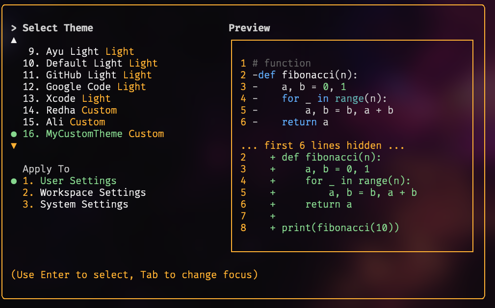

# 佈景主題 (Themes)

Gemini CLI 支援多種佈景主題，讓你可以自訂其配色方案與外觀。你可以透過 `/theme` 指令或 `"theme":` 設定來變更佈景主題，以符合你的個人偏好。

## 可用佈景主題

Gemini CLI 提供多種預設佈景主題，你可以在 Gemini CLI 內使用 `/theme` 指令來列出所有可用主題：

- **深色主題 (Dark Themes)：**
  - `ANSI`
  - `Atom One`
  - `Ayu`
  - `Default`
  - `Dracula`
  - `GitHub`
- **淺色主題 (Light Themes)：**
  - `ANSI Light`
  - `Ayu Light`
  - `Default Light`
  - `GitHub Light`
  - `Google Code`
  - `Xcode`

### 切換佈景主題

1.  在 Gemini CLI 輸入 `/theme`。
2.  會出現一個對話框或選擇提示，列出所有可用佈景主題。
3.  使用方向鍵選擇佈景主題。有些介面在選擇時會即時預覽或高亮顯示。
4.  確認選擇以套用該佈景主題。

**注意：** 如果你的 `settings.json` 檔案中（無論是以名稱或檔案路徑）已定義佈景主題，則必須先從檔案中移除 `"theme"` 設定，才能使用 `/theme` 指令變更佈景主題。

### 佈景主題持久化

所選佈景主題會儲存在 Gemini CLI 的 [設定檔](./configuration.md) 中，因此你的偏好會在不同工作階段間自動保留。

---

## 自訂顏色佈景主題

Gemini CLI 允許你在 `settings.json` 檔案中自訂顏色佈景主題，讓你能完全掌控 CLI 的配色方案。

### 如何定義自訂佈景主題

在你的使用者、專案或系統 `settings.json` 檔案中新增 `customThemes` 區塊。每個自訂佈景主題都以唯一名稱與一組顏色鍵 (color keys) 定義。例如：

```json
{
  "ui": {
    "customThemes": {
      "MyCustomTheme": {
        "name": "MyCustomTheme",
        "type": "custom",
        "Background": "#181818",
        ...
      }
    }
  }
}
```

**顏色鍵值說明：**

- `Background`
- `Foreground`
- `LightBlue`
- `AccentBlue`
- `AccentPurple`
- `AccentCyan`
- `AccentGreen`
- `AccentYellow`
- `AccentRed`
- `Comment`
- `Gray`
- `DiffAdded`（選用，用於 diff 新增行）
- `DiffRemoved`（選用，用於 diff 移除行）
- `DiffModified`（選用，用於 diff 修改行）

**必要屬性：**

- `name`（必須與 `customThemes` 物件中的鍵值相符，且為字串）
- `type`（必須為字串 `"custom"`）
- `Background`
- `Foreground`
- `LightBlue`
- `AccentBlue`
- `AccentPurple`
- `AccentCyan`
- `AccentGreen`
- `AccentYellow`
- `AccentRed`
- `Comment`
- `Gray`

你可以對任何顏色值使用十六進位色碼（例如：`#FF0000`）**或**標準 CSS 顏色名稱（例如：`coral`、`teal`、`blue`）。完整支援的名稱請參見 [CSS 顏色名稱 (CSS color names)](https://developer.mozilla.org/en-US/docs/Web/CSS/color_value#color_keywords)。

你可以在 `customThemes` 物件中加入多個自訂佈景主題（custom theme）。

### 從檔案載入佈景主題

除了在 `settings.json` 中定義自訂佈景主題外，你也可以透過在 `settings.json` 指定佈景主題檔案（theme file）的路徑，直接從 JSON 檔案載入佈景主題。這在分享佈景主題或將其與主要設定分離時特別有用。

若要從檔案載入佈景主題，請在 `settings.json` 中設定 `theme` 屬性為你的佈景主題檔案路徑：

```json
{
  "ui": {
    "theme": "/path/to/your/theme.json"
  }
}
```

佈景主題檔案必須是一個有效的 JSON 檔案，且需遵循與`settings.json`中定義的自訂佈景主題相同的結構。

**範例 `my-theme.json`：**

```json
{
  "name": "My File Theme",
  "type": "custom",
  "Background": "#282A36",
  "Foreground": "#F8F8F2",
  "LightBlue": "#82AAFF",
  "AccentBlue": "#61AFEF",
  "AccentPurple": "#BD93F9",
  "AccentCyan": "#8BE9FD",
  "AccentGreen": "#50FA7B",
  "AccentYellow": "#F1FA8C",
  "AccentRed": "#FF5555",
  "Comment": "#6272A4",
  "Gray": "#ABB2BF",
  "DiffAdded": "#A6E3A1",
  "DiffRemoved": "#F38BA8",
  "DiffModified": "#89B4FA",
  "GradientColors": ["#4796E4", "#847ACE", "#C3677F"]
}
```

**安全性提示：** 為了您的安全，Gemini CLI 只會載入位於您的家目錄中的佈景主題檔案。如果您嘗試從家目錄以外的位置載入佈景主題，系統會顯示警告，且該佈景主題不會被載入。此設計是為了防止從不受信任來源載入可能具有惡意的佈景主題檔案。

### 自訂佈景主題範例



### 使用您的自訂佈景主題

- 在 Gemini CLI 中使用 `/theme` 指令選擇您的自訂佈景主題。您的自訂佈景主題會出現在佈景主題選擇對話框中。
- 或者，將其設為預設佈景主題，只需在您的 `settings.json` 的 `ui` 物件中新增 `"theme": "MyCustomTheme"`。
- 自訂佈景主題可以設定於使用者、專案或系統層級，並遵循與其他設定相同的[設定優先順序](./configuration.md)。

---

## 深色佈景主題

### ANSI


### Atom OneDark


### Ayu


### 預設


### Dracula


### GitHub


## 淺色佈景主題

### ANSI Light


### Ayu Light


### 預設淺色


### GitHub Light


### Google Code


### Xcode


