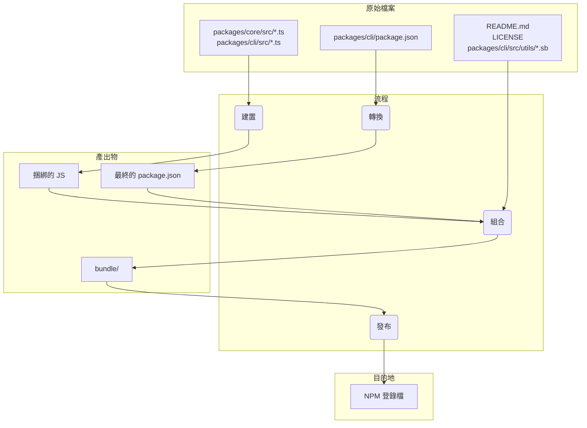

# 套件總覽

此 monorepo 包含兩個主要套件：`@google/gemini-cli` 和 `@google/gemini-cli-core`。

## `@google/gemini-cli`

這是 Gemini CLI 的主要套件。它負責使用者介面、指令剖析以及所有其他面向使用者的功能。

此套件發布時，會被捆綁成一個單一的可執行檔。此捆綁包包含所有套件的相依性，包括 `@google/gemini-cli-core`。這表示無論使用者是使用 `npm install -g @google/gemini-cli` 安裝套件，還是使用 `npx @google/gemini-cli` 直接執行，他們使用的都是這個單一、獨立的可執行檔。

## `@google/gemini-cli-core`

此套件包含與 Gemini API 互動的核心邏輯。它負責發出 API 請求、處理驗證以及管理本機快取。

此套件不會被捆綁。發布時，它會以標準 Node.js 套件的形式發布，並帶有自己的相依性。這使得它可以在需要時作為獨立套件在其他專案中使用。`dist` 資料夾中所有轉譯後的 js 程式碼都包含在套件中。

# 發行流程

本專案遵循結構化的發行流程，以確保所有套件都能正確地進行版本控制和發布。此流程旨在盡可能地自動化。

## 如何發行

發行是透過 [release.yml](https://github.com/google-gemini/gemini-cli/actions/workflows/release.yml) GitHub Actions 工作流程進行管理。若要手動發行修補程式或緊急修復：

1.  導覽至儲存庫的 **Actions** 索引標籤。
2.  從清單中選取 **Release** 工作流程。
3.  按一下 **Run workflow** 下拉式按鈕。
4.  填寫必要的輸入：
    - **Version**：要發行的確切版本 (例如 `v0.2.1`)。
    - **Ref**：要從中發行的分支或提交 SHA (預設為 `main`)。
    - **Dry Run**：保留為 `true` 以測試工作流程而不發布，或設定為 `false` 以執行即時發行。
5.  按一下 **Run workflow**。

## 每夜發行

除了手動發行外，本專案還有一個自動化的每夜發行流程，以提供最新的「前衛」版本供測試和開發之用。

### 流程

每天午夜 UTC，[Release workflow](https://github.com/google-gemini/gemini-cli/actions/workflows/release.yml) 會自動按排程執行。它會執行以下步驟：

1.  從 `main` 分支簽出最新的程式碼。
2.  安裝所有相依性。
3.  執行完整的 `preflight` 檢查和整合測試。
4.  如果所有測試都成功，它會計算下一個每夜版本號 (例如 `v0.2.1-nightly.20230101`)。
5.  然後它會建置套件並將其發布到 npm，並帶有 `nightly` dist-tag。
6.  最後，它會為每夜版本建立一個 GitHub Release。

### 失敗處理

如果每夜工作流程中的任何步驟失敗，它會自動在儲存庫中建立一個帶有 `bug` 和 `nightly-failure` 標籤的新問題。該問題將包含一個指向失敗工作流程執行的連結，以便於偵錯。

### 如何使用每夜建置

若要安裝最新的每夜建置，請使用 `@nightly` 標籤：

```bash
npm install -g @google/gemini-cli@nightly
```

我們也執行一個名為 [release-docker.yml](https://github.com/google-gemini/gemini-cli/blob/main/.gcp/release-docker.yaml) 的 Google Cloud Build。它會發布沙盒 docker 以符合您的發行版本。一旦服務帳戶權限問題解決，這也將移至 GH 並與主要發行檔案合併。

### 發行後

工作流程成功完成後，您可以在 [GitHub Actions tab](https://github.com/google-gemini/gemini-cli/actions/workflows/release.yml) 中監控其進度。完成後，您應該：

1.  前往儲存庫的 [pull requests page](https://github.com/google-gemini/gemini-cli/pulls)。
2.  從 `release/vX.Y.Z` 分支建立一個新的拉取請求到 `main`。
3.  檢閱拉取請求 (它應該只包含 `package.json` 檔案中的版本更新) 並合併它。這可以讓 `main` 中的版本保持最新。

## 發行驗證

推送新版本後，應執行冒煙測試以確保套件如預期般運作。這可以透過在本機安裝套件並執行一組測試來完成，以確保它們功能正常。

- `npx -y @google/gemini-cli@latest --version` 以驗證推送是否如預期般運作 (如果您未使用 rc 或 dev 標籤)
- `npx -y @google/gemini-cli@<release tag> --version` 以驗證標籤是否已適當推送
- _這在本機上是破壞性的_ `npm uninstall @google/gemini-cli && npm uninstall -g @google/gemini-cli && npm cache clean --force &&  npm install @google/gemini-cli@<version>`
- 建議進行基本的冒煙測試，執行一些 llm 指令和工具，以確保套件如預期般運作。我們未來會將此流程更明確地寫成程式碼。

## 何時合併版本變更，何時不合併？

上述從目前或較舊的提交建立修補程式或緊急修復版本的模式，會讓儲存庫處於以下狀態：

1.  標籤 (`vX.Y.Z-patch.1`)：此標籤正確地指向 main 上包含您打算發行之穩定程式碼的原始提交。這至關重要。任何簽出此標籤的人都會得到已發布的確切程式碼。
2.  分支 (`release-vX.Y.Z-patch.1`)：此分支在標記的提交之上包含一個新的提交。該新提交僅包含 package.json (以及其他相關檔案，如 package-lock.json) 中的版本號變更。

這種分離是好的。它讓您的 main 分支歷史保持乾淨，不會有特定於發行的版本更新，直到您決定合併它們為止。

這是關鍵的決定，完全取決於發行的性質。

### 穩定修補程式和緊急修復版本應合併回來

對於任何穩定的修補程式或緊急修復版本，您幾乎總是希望將 `release-<tag>` 分支合併回 `main`。

- 為什麼？主要原因是更新 main 的 package.json 中的版本。如果您從較舊的提交發行 v1.2.1，但從未將版本更新合併回來，您的 main 分支的 package.json 仍會顯示 "version": "1.2.0"。下一個為下一個功能版本 (v1.3.0) 開始工作的開發人員，將會從一個版本號不正確、較舊的程式碼庫分支。這會導致混淆，並需要在稍後手動更新版本。
- 流程：在 release-v1.2.1 分支建立並成功發布套件後，您應該開啟一個拉取請求，將 release-v1.2.1 合併到 main。此 PR 將只包含一個提交：「chore: bump version to v1.2.1」。這是一個乾淨、簡單的整合，可讓您的 main 分支與最新發行版本保持同步。

### 預發行版本 (RC、Beta、Dev) 不應合併回來

您通常不會將預發行版本的發行分支合併回 `main`。

- 為什麼？預發行版本 (例如 v1.3.0-rc.1、v1.3.0-rc.2) 根據定義是不穩定的，而且是暫時的。您不希望用一系列候選版本的版本更新來污染您的 main 分支歷史。main 中的 package.json 應該反映最新的穩定發行版本，而不是 RC 版本。
- 流程：release-v1.3.0-rc.1 分支被建立，npm publish --tag rc 發生，然後...該分支就完成了它的使命。您可以直接刪除它。RC 的程式碼已經在 main (或功能分支) 上，所以不會遺失任何功能性程式碼。發行分支只是版本號的暫時載體。

## 本機測試與驗證：封裝與發布流程的變更

如果您需要在不實際發布到 NPM 或建立公開 GitHub 發行的情況下測試發行流程，您可以從 GitHub UI 手動觸發工作流程。

1.  前往儲存庫的 [Actions tab](https://github.com/google-gemini/gemini-cli/actions/workflows/release.yml)。
2.  按一下「Run workflow」下拉式選單。
3.  勾選 `dry_run` 選項 (`true`)。
4.  按一下「Run workflow」按鈕。

這將執行整個發行流程，但會跳過 `npm publish` 和 `gh release create` 步驟。您可以檢查工作流程日誌，以確保一切如預期般運作。

在提交任何對封裝和發布流程的變更之前，在本機進行測試至關重要。這可以確保套件將被正確發布，並且在使用者安裝後能如預期般運作。

若要驗證您的變更，您可以執行發布流程的空跑 (dry run)。這將模擬發布流程，而不會實際將套件發布到 npm 登錄檔。

```bash
npm_package_version=9.9.9 SANDBOX_IMAGE_REGISTRY="registry" SANDBOX_IMAGE_NAME="thename" npm run publish:npm --dry-run
```

此指令將執行以下操作：

1.  建置所有套件。
2.  執行所有 prepublish 指令碼。
3.  建立將發布到 npm 的套件 tarball。
4.  列印將發布之套件的摘要。

然後您可以檢查產生的 tarball，以確保它們包含正確的檔案，並且 `package.json` 檔案已正確更新。tarball 將在每個套件目錄的根目錄中建立 (例如 `packages/cli/google-gemini-cli-0.1.6.tgz`)。

透過執行空跑，您可以確信您對封裝流程的變更是正確的，並且套件將成功發布。

## 發行深入探討

發行流程的主要目標是從 packages/ 目錄中取得原始程式碼，加以建置，並在專案根目錄的暫存 `bundle` 目錄中組合成一個乾淨、獨立的套件。這個 `bundle` 目錄才是實際發布到 NPM 的內容。

以下是關鍵階段：

階段 1：發行前健全性檢查與版本控制

- 發生什麼事：在移動任何檔案之前，流程會確保專案處於良好狀態。這包括執行測試、程式碼檢查和型別檢查 (npm run preflight)。根目錄 package.json 和 packages/cli/package.json 中的版本號會更新為新的發行版本。
- 為什麼：這保證只會發行高品質、可運作的程式碼。版本控制是標示新發行的第一步。

階段 2：建置原始程式碼

- 發生什麼事：packages/core/src 和 packages/cli/src 中的 TypeScript 原始程式碼會被編譯成 JavaScript。
- 檔案移動：
  - packages/core/src/\*_/_.ts -> 編譯成 -> packages/core/dist/
  - packages/cli/src/\*_/_.ts -> 編譯成 -> packages/cli/dist/
- 為什麼：開發期間編寫的 TypeScript 程式碼需要轉換成可由 Node.js 執行的純 JavaScript。由於 cli 套件相依於 core 套件，因此會先建置 core 套件。

階段 3：組合最終可發布的套件

這是最關鍵的階段，檔案會被移動並轉換成最終發布的狀態。會在專案根目錄建立一個暫存的 `bundle` 資料夾，以存放最終的套件內容。

1.  `package.json` 的轉換：
    - 發生什麼事：讀取 packages/cli/ 的 package.json，加以修改，然後寫入根目錄的 `bundle`/ 目錄。負責此項工作的指令碼是 scripts/prepare-cli-packagejson.js。
    - 檔案移動：packages/cli/package.json -> (記憶中轉換) -> `bundle`/package.json
    - 為什麼：最終的 package.json 必須與開發時使用的不同。主要變更包括：
      - 移除 devDependencies。
      - 移除工作區特定的 "dependencies": { "@gemini-cli/core": "workspace:\*" }，並確保核心程式碼直接捆綁到最終的 JavaScript 檔案中。
      - 確保 bin、main 和 files 欄位指向最終套件結構中的正確位置。

2.  建立 JavaScript 捆綁包：
    - 發生什麼事：將 packages/core/dist 和 packages/cli/dist 中建置的 JavaScript 捆綁成一個單一、可執行的 JavaScript 檔案。
    - 檔案移動：packages/cli/dist/index.js + packages/core/dist/index.js -> (由 esbuild 捆綁) -> `bundle`/gemini.js (或類似名稱)。
    - 為什麼：這會建立一個單一、最佳化的檔案，其中包含所有必要的應用程式程式碼。它簡化了套件，因為核心套件的程式碼現在直接包含在內，不再需要作為 NPM 上的單獨相依性。

3.  複製靜態與支援檔案：
    - 發生什麼事：將不屬於原始程式碼但套件正常運作或清楚描述所必需的檔案複製到 `bundle` 目錄中。
    - 檔案移動：
      - README.md -> `bundle`/README.md
      - LICENSE -> `bundle`/LICENSE
      - packages/cli/src/utils/\*.sb (沙盒設定檔) -> `bundle`/
    - 為什麼：
      - README.md 和 LICENSE 是任何 NPM 套件都應包含的標準檔案。
      - 沙盒設定檔 (.sb 檔案) 是 CLI 沙盒功能運作所需的關鍵執行階段資產。它們必須位於最終可執行檔旁邊。

階段 4：發布到 NPM

- 發生什麼事：從根目錄的 `bundle` 目錄中執行 npm publish 指令。
- 為什麼：透過從 `bundle` 目錄中執行 npm publish，只有我們在階段 3 中仔細組合的檔案才會上傳到 NPM 登錄檔。這可以防止任何原始程式碼、測試檔案或開發設定被意外發布，從而為使用者提供一個乾淨、精簡的套件。

檔案流程摘要



此流程確保最終發布的產出物是專為目的而建置、乾淨且有效率的專案表示，而不是開發工作區的直接複本。

## NPM Workspaces

本專案使用 [NPM Workspaces](https://docs.npmjs.com/cli/v10/using-npm/workspaces) 來管理此 monorepo 中的套件。這可以讓我們從專案的根目錄管理多個套件的相依性和執行指令碼，從而簡化開發。

### 運作方式

根目錄的 `package.json` 檔案定義了本專案的工作區：

```json
{
  "workspaces": ["packages/*"]
}
```

這告訴 NPM，`packages` 目錄中的任何資料夾都是一個單獨的套件，應作為工作區的一部分進行管理。

### Workspaces 的好處

- **簡化的相依性管理**：從專案根目錄執行 `npm install` 將會安裝工作區中所有套件的所有相依性，並將它們連結在一起。這表示您不需要在每個套件的目錄中執行 `npm install`。
- **自動連結**：工作區中的套件可以相互依賴。當您執行 `npm install` 時，NPM 會自動在套件之間建立符號連結。這表示當您對一個套件進行變更時，相依於它的其他套件可以立即使用這些變更。
- **簡化的指令碼執行**：您可以使用 `--workspace` 旗標從專案根目錄在任何套件中執行指令碼。例如，若要在 `cli` 套件中執行 `build` 指令碼，您可以執行 `npm run build --workspace @google/gemini-cli`。