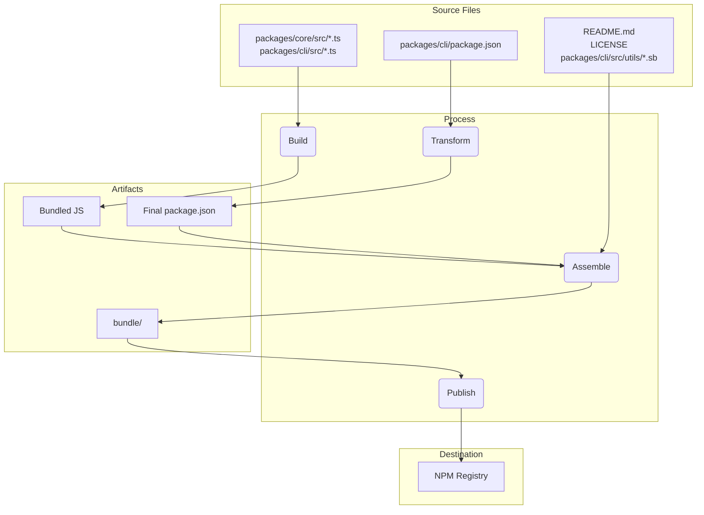

# Gemini CLI 發行版本

## 發行節奏與標籤

我們將盡可能遵循https://semver.org/，但若有需要偏離，會特別說明。我們每週的發行將以次版本號（minor version）遞增，若在兩次發行之間有任何錯誤修正或緊急修補（hotfix），則會以最新發行版本的修補版本號（patch version）釋出。

每週二約 2000 UTC 會釋出新的 Stable 及 Preview 發行版本。推進流程如下：

- 程式碼提交到 main 分支 (main branch)，並於每晚推送到 `nightly` 標籤
- 程式碼在 main 分支 (main branch) 上最多保留 1 週後，會推升至`preview`頻道
- 1 週後，最新的`preview`頻道會被推升至`stable`頻道
- 依需求針對`preview`與`stable`產生修補（patch）版本，每次修補版本號會遞增

### Preview

這些發行版本尚未經過完整驗證，可能包含回歸問題或其他未解決的問題。請協助我們測試，並使用`preview`標籤安裝。

```bash
npm install -g @google/gemini-cli@preview
```

### Stable

這將是上週發佈版本的完整升級版，並包含任何錯誤修正與驗證。請使用 `latest` 標籤。

```bash
npm install -g @google/gemini-cli@latest
```

### Nightly

- 新版本將於每天 UTC 0000 發佈。這將包含截至發佈時 main 分支 (main branch) 上的所有變更。請假設仍有待驗證事項與潛在問題。請使用 `nightly` 標籤。

```bash
npm install -g @google/gemini-cli@nightly
```

## 每週版本發佈推升

每週二，值班工程師會觸發「Promote Release」工作流程。這個單一動作會自動化整個每週版本發佈流程：

1.  **將 Preview 推升為 Stable：** 工作流程會識別最新的 `preview` 版本並將其推升為 `stable`。這會成為 npm 上新的 `latest` 版本。
2.  **將 Nightly 推升為 Preview：** 接著會將最新的 `nightly` 版本推升為新的 `preview` 版本。
3.  **準備下一個 Nightly：** 系統會自動建立並合併一個 pull request，將 `main` 的版本號提升，以準備下一次 nightly 發佈。

這個流程確保了發佈節奏的一致性與可靠性，並將人工干預降到最低。

### 版本控管的唯一依據

為了確保最高可靠性，版本推升流程以 **NPM registry 作為唯一的版本控管依據**，用來判斷每個發佈通道（`stable`、`preview`、`nightly`）的當前版本。

1.  **從 NPM 取得資訊：** 工作流程會先查詢 NPM 的 `dist-tags`（`latest`、`preview`、`nightly`），以取得目前用戶可用套件的精確版本字串。
2.  **完整性交叉檢查：** 對於從 NPM 取得的每個版本，工作流程都會進行關鍵的完整性檢查：
    - 驗證儲存庫中是否存在對應的 **git tag**。
    - 驗證是否已建立對應的 **GitHub Release**。
3.  **發現不一致時停止：** 如果 NPM 上列出的某個版本缺少 git tag 或 GitHub Release，工作流程會立即失敗。這項嚴格檢查可防止來自損壞或不完整前一版本的推升，並提醒值班工程師有發佈狀態不一致，需人工處理。
4.  **計算下一個版本號：** 只有在上述檢查全部通過後，工作流程才會根據從 NPM 取得的可信版本號計算下一個語意化版本。

這種以 NPM 為主、結合完整性檢查的做法，讓發佈流程極為穩健，有效避免僅依賴 git 歷史或 API 輸出時可能出現的版本不一致問題。

## 手動發佈

若遇到需要在常規 nightly 與每週推升排程之外發佈（且不屬於修補流程範疇）的情境，可以使用 `Release: Manual` 工作流程。此流程可讓你直接從任何分支、tag 或 commit SHA 發佈指定版本。

### 如何建立手動發佈

1.  前往儲存庫的 **Actions** 分頁。
2.  從清單中選擇 **Release: Manual** 工作流程。
3.  點擊 **Run workflow** 下拉按鈕。
4.  填寫必要欄位：
    - **Version**：要發佈的精確版本（例如 `v0.6.1`）。必須為帶有 `v` 前綴的有效語意化版本號。
    - **Ref**：要發佈的分支、tag 或完整 commit SHA。
    - **NPM Channel**：要發佈到的 npm 標籤。一般發佈選擇 `stable`，預發佈選擇 `preview`，若完全不發佈到 npm 則選 `none`。
    - **Dry Run**：保持為 `true` 會執行所有步驟但不實際發佈，設為 `false` 則會進行正式發佈。
    - **Force Skip Tests**：設為 `true` 可跳過測試流程（不建議用於正式發佈）。
5.  點擊 **Run workflow**。

接下來，工作流程會進行測試（若未跳過）、建置並發佈版本。若流程在非 dry run 狀態下失敗，系統會自動建立一個 GitHub issue 並附上失敗細節。

## 回滾／前滾

若某次發佈出現嚴重回歸問題，你可以快速將 npm `dist-tag` 指回先前穩定版本（回滾），或指向新修補版本（前滾）。`Release: Change Tags` 工作流程提供了安全、可控的方式來完成這項操作。

這是回滾與前滾的首選方法，因為它不需要完整的發佈流程。

### 如何變更發佈標籤

1.  前往儲存庫的 **Actions** 分頁。
2.  從清單中選擇 **Release: Change Tags** 工作流程。
3.  點擊 **Run workflow** 下拉按鈕。
4.  填寫必要欄位：
    - **Version**：你要將標籤指向的現有套件版本（例如 `0.5.0-preview-2`）。此版本**必須**已發佈到 npm registry。
    - **Channel**：要套用的 npm `dist-tag`（例如 `preview`、`stable`）。
    - **Dry Run**：保持為 `true` 只記錄動作不做實際變更，設為 `false` 則會實際變更標籤。
5.  點擊 **Run workflow**。

工作流程會針對 `@google/gemini-cli` 與 `@google/gemini-cli-core` 兩個套件執行 `npm dist-tag add`，將指定 channel 指向指定版本。

## 修補（Patching）

如果某個重大錯誤已在 `main` 上修正，但需要回補到 `stable` 或 `preview` 發佈版本，現在的修補流程已高度自動化。

### 如何進行修補

#### 1. 建立修補 Pull Request

有兩種方式可以建立修補 pull request：

**方案 A：透過 GitHub 留言（推薦）**

當包含修正的 pull request 已合併後，維護者可在該 PR 下方留言，格式如下：

`/patch [channel]`

- **channel**（可選）：
  - _不指定 channel_：同時修補 stable 與 preview channel（預設，建議大多數修正使用）
  - `both`：同時修補 stable 與 preview channel（與預設相同）
  - `stable`：僅修補 stable channel
  - `preview`：僅修補 preview channel

範例：

- `/patch`（同時修補 stable 與 preview，預設）
- `/patch both`（同時修補 stable 與 preview，明確指定）
- `/patch stable`（僅修補 stable）
- `/patch preview`（僅修補 preview）

`Release: Patch from Comment` 工作流程會自動尋找 merge commit SHA 並觸發 `Release: Patch (1) Create PR` 工作流程。若 PR 尚未合併，系統會留言提示失敗。

**方案 B：手動觸發工作流程**

前往 **Actions** 分頁並執行 **Release: Patch (1) Create PR** 工作流程。

- **Commit**：你想要 cherry-pick 的 `main` 上完整 SHA。
- **Channel**：你要修補的 channel（`stable` 或 `preview`）。

此工作流程會自動：

1.  找出該 channel 的最新發佈 tag。
2.  若尚未存在，從該 tag 建立發佈分支（例如 `release/v0.5.1`）。
3.  從發佈分支建立新的 hotfix 分支。
4.  將指定 commit cherry-pick 到 hotfix 分支。
5.  從 hotfix 分支建立 pull request 回發佈分支。

#### 2. 審查與合併

審查自動建立的 pull request，確認 cherry-pick 成功且內容正確。審核通過後即可合併。

**安全注意事項：** `release/*` 分支受分支保護規則保護。對這些分支的 pull request 必須經過至少一位程式碼擁有者審查，才能合併。此舉確保未經授權的程式碼不會被釋出。

#### 2.5. 將多個 Commit 加入同一 Hotfix（進階）

如果你需要在單一修補版本中納入多個修正，可以在初始修補 PR 建立後，將額外 commit 加入 hotfix 分支：

1. **從主要修正開始**：在最重要的 PR 上使用 `/patch`（或 `/patch both`）來建立初始 hotfix 分支與 PR。

2. **在本地端檢出 hotfix 分支**：

   ```bash
   git fetch origin
   git checkout hotfix/v0.5.1/stable/cherry-pick-abc1234  # Use the actual branch name from the PR
   ```

3. **擷取（cherry-pick）其他提交紀錄**：

   ```bash
   git cherry-pick <commit-sha-1>
   git cherry-pick <commit-sha-2>
   # Add as many commits as needed
   ```

4. **推送已更新的分支**：

   ```bash
   git push origin hotfix/v0.5.1/stable/cherry-pick-abc1234
   ```

5. **測試與審查**：現有的 patch PR 會自動隨著你新增的 commit 更新。由於你現在要同時釋出多個變更，請務必徹底測試。

6. **更新 PR 描述**：建議更新 PR 標題與描述，以反映這次包含了多項修復。

這種做法讓你能將相關的修復集中在單一 patch 版本中釋出，同時完全掌控要納入哪些內容以及如何解決衝突。

#### 3. 自動化釋出

當 pull request 合併後，`Release: Patch (2) Trigger` workflow 會自動觸發。接著它會啟動 `Release: Patch (3) Release` workflow，該流程將會：

1. 建置並測試已修補的程式碼。
2. 將新的 patch 版本發佈到 npm。
3. 以 patch notes 建立新的 GitHub Release。

這個全自動化流程可確保 patch 的建立與釋出始終如一且可靠。

#### 疑難排解：舊分支的 Workflow

**問題**：如果 patch trigger workflow 失敗，出現 "Resource not accessible by integration" 或提及不存在的 workflow 檔案（例如：`patch-release.yml`）等錯誤，這表示 hotfix 分支包含了過時的 workflow 檔案版本。

**根本原因**：當 PR 合併時，GitHub Actions 會執行**來源分支**（即 hotfix 分支）上的 workflow 定義，而不是目標分支（release 分支）上的。如果 hotfix 分支是從早於 workflow 改進的舊 release 分支建立的，它就會使用舊的 workflow 邏輯。

**解決方法**：

**方案一：手動觸發（快速修復）**  
從擁有最新 workflow 程式碼的分支手動觸發已更新的 workflow：

```bash
# For a preview channel patch with tests skipped
gh workflow run release-patch-2-trigger.yml --ref <branch-with-updated-workflow> \
  --field ref="hotfix/v0.6.0-preview.2/preview/cherry-pick-abc1234" \
  --field workflow_ref=<branch-with-updated-workflow> \
  --field dry_run=false \
  --field force_skip_tests=true

# For a stable channel patch
gh workflow run release-patch-2-trigger.yml --ref <branch-with-updated-workflow> \
  --field ref="hotfix/v0.5.1/stable/cherry-pick-abc1234" \
  --field workflow_ref=<branch-with-updated-workflow> \
  --field dry_run=false \
  --field force_skip_tests=false

# Example using main branch (most common case)
gh workflow run release-patch-2-trigger.yml --ref main \
  --field ref="hotfix/v0.6.0-preview.2/preview/cherry-pick-abc1234" \
  --field workflow_ref=main \
  --field dry_run=false \
  --field force_skip_tests=true
```

**注意**：請將 `<branch-with-updated-workflow>` 替換為包含最新工作流程改進的分支（通常是 `main`，但如果正在測試更新，也可能是某個功能分支）。

**選項 2：更新 Hotfix 分支**
將最新的 main 分支 (main branch) 合併到你的 hotfix 分支，以取得已更新的工作流程：

```bash
git checkout hotfix/v0.6.0-preview.2/preview/cherry-pick-abc1234
git merge main
git push
```

然後關閉並重新開啟 PR，以使用已更新版本重新觸發 workflow。

**選項 3：直接觸發發佈（Direct Release Trigger）**
完全跳過觸發 workflow，直接執行 release workflow：

```bash
# Replace channel and release_ref with appropriate values
gh workflow run release-patch-3-release.yml --ref main \
  --field type="preview" \
  --field dry_run=false \
  --field force_skip_tests=true \
  --field release_ref="release/v0.6.0-preview.2"
```

### Docker

我們也會執行一個 Google Cloud Build，稱為 [release-docker.yml](../.gcp/release-docker.yml)。它會發佈 sandbox Docker，以符合你的發佈版本。待服務帳戶（service account）權限設定完成後，這部分也會移轉到 GitHub，並與主要的發佈檔案合併。

## 發佈驗證（Release Validation）

在推送新版本後，應進行 smoke testing（冒煙測試），以確保套件運作如預期。你可以在本地安裝這些套件，並執行一系列測試，以確保它們正常運作。

- `npx -y @google/gemini-cli@latest --version` 用於驗證推送是否如預期運作（如果你不是在做 rc 或 dev 標籤）
- `npx -y @google/gemini-cli@<release tag> --version` 用於驗證標籤是否正確推送
- _這會在本地造成破壞性影響_ `npm uninstall @google/gemini-cli && npm uninstall -g @google/gemini-cli && npm cache clean --force &&  npm install @google/gemini-cli@<version>`
- 建議進行冒煙測試，簡單執行幾個大型語言模型 (LLM) 指令與工具，以確保套件如預期運作。未來我們會將這部分流程進一步標準化。

## 本地測試與驗證：套件打包與發佈流程的變更

如果你需要在不實際發佈到 npm 或建立公開 GitHub 發佈的情況下測試發佈流程，可以從 GitHub UI 手動觸發 workflow。

1. 前往儲存庫的 [Actions 分頁](https://github.com/google-gemini/gemini-cli/actions/workflows/release-manual.yml)。
2. 點擊「Run workflow」下拉選單。
3. 保持 `dry_run` 選項勾選（`true`）。
4. 點擊「Run workflow」按鈕。

這會執行完整的發佈流程，但會略過 `npm publish` 和 `gh release create` 步驟。你可以檢查 workflow 日誌，確保一切如預期運作。

在提交任何套件打包與發佈流程的變更前，務必先在本地進行測試。這可確保套件能正確發佈，且使用者安裝時能如預期運作。

為了驗證你的變更，你可以執行一次發佈流程的 dry run（模擬執行）。這會模擬發佈流程，但不會實際將套件發佈到 npm registry。

```bash
npm_package_version=9.9.9 SANDBOX_IMAGE_REGISTRY="registry" SANDBOX_IMAGE_NAME="thename" npm run publish:npm --dry-run
```

此指令將執行以下動作：

1.  建置所有套件。
2.  執行所有 prepublish 腳本 (scripts)。
3.  建立將要發佈到 npm 的套件壓縮檔 (tarballs)。
4.  列印將要發佈的套件摘要。

你可以檢查產生的壓縮檔，確保它們包含正確的檔案，且 `package.json` 檔案已正確更新。這些壓縮檔會建立在各套件目錄的根目錄下（例如：`packages/cli/google-gemini-cli-0.1.6.tgz`）。

透過執行 dry run（模擬發佈），你可以確信你對封裝流程的更動是正確的，並且套件將能順利發佈。

## 發佈流程深度解析

發佈流程的主要目標，是將 packages/ 目錄下的原始碼建置，並在專案根目錄下的暫存 `bundle` 目錄中，組裝成乾淨、獨立的套件。這個 `bundle` 目錄才是真正會被發佈到 NPM 的內容。

以下是主要階段：

階段 1：發佈前檢查與版本設定

- 執行內容：在任何檔案移動之前，流程會確保專案處於良好狀態。這包括執行測試、程式碼檢查 (linting) 及型別檢查（npm run preflight）。根目錄的 package.json 及 packages/cli/package.json 會更新為新的發佈版本號。
- 原因：這可確保只有高品質且可運作的程式碼會被發佈。版本設定則是標示新發佈的第一步。

階段 2：建置原始碼

- 執行內容：將 packages/core/src 與 packages/cli/src 中的 TypeScript 原始碼編譯為 JavaScript。
- 檔案移動：
  - packages/core/src/\*_/_.ts -> 編譯後 -> packages/core/dist/
  - packages/cli/src/\*_/_.ts -> 編譯後 -> packages/cli/dist/
- 原因：開發時撰寫的 TypeScript 程式碼需轉換為 Node.js 可執行的純 JavaScript。Core 套件會先建置，因為 CLI 套件依賴於它。

階段 3：組裝最終可發佈套件

這是最關鍵的階段，檔案會被移動並轉換為發佈所需的最終狀態。專案根目錄下會建立一個暫存 `bundle` 資料夾，用來存放最終套件內容。

1.  `package.json` 的轉換：
    - 執行內容：讀取 packages/cli/ 的 package.json，經過修改後寫入到根目錄的 `bundle`/ 目錄。
    - 檔案移動：packages/cli/package.json ->（記憶體內轉換）-> `bundle`/package.json
    - 原因：最終的 package.json 需與開發時不同。主要變更包括：
      - 移除 devDependencies。
      - 移除 workspace 專用的 "dependencies": { "@gemini-cli/core": "workspace:\*" }，並確保 core 程式碼已直接封裝進最終的 JavaScript 檔案中。
      - 確保 bin、main、files 欄位指向最終套件結構中的正確位置。

2.  建立 JavaScript bundle：
    - 執行內容：將 packages/core/dist 與 packages/cli/dist 的建置後 JavaScript 合併成單一可執行的 JavaScript 檔案。
    - 檔案移動：packages/cli/dist/index.js + packages/core/dist/index.js ->（由 esbuild 打包）-> `bundle`/gemini.js（或類似名稱）。
    - 原因：這樣會產生一個單一且最佳化的檔案，包含所有必要的應用程式碼。這也簡化了套件，因為 core 套件的程式碼已直接包含，無需再於 NPM 上作為獨立依賴。

3.  複製靜態與支援檔案：
    - 執行內容：將非原始碼但套件運作或描述所需的重要檔案，複製到 `bundle` 目錄。
    - 檔案移動：
      - README.md -> `bundle`/README.md
      - LICENSE -> `bundle`/LICENSE
      - packages/cli/src/utils/\*.sb（沙箱機制設定檔）-> `bundle`/
    - 原因：
      - README.md 與 LICENSE 是所有 NPM 套件都應包含的標準檔案。
      - 沙箱機制設定檔（.sb 檔案）是 CLI 沙箱機制功能執行時所需的重要資產，必須與最終可執行檔放在一起。

階段 4：發佈到 NPM

- 執行內容：從根目錄下的 `bundle` 目錄執行 npm publish 指令。
- 原因：從 `bundle` 目錄內執行 npm publish，只會將我們在階段 3 仔細組裝的檔案上傳到 NPM registry。這可避免原始碼、測試檔案或開發設定被誤發佈，確保用戶獲得乾淨且精簡的套件。

檔案流程摘要



此流程可確保最終發佈的產物是一個專為此專案打造、乾淨且高效的成果，而非開發 workspace 的直接複製品。

## 通知

當發佈流程失敗時，系統會自動建立一個帶有標籤 `release-failure` 的 Issue。

當這類型的 Issue 被建立時，會在維護者的聊天室頻道中發送通知。

### 修改聊天室通知

通知功能使用 [GitHub for Google Chat](https://workspace.google.com/marketplace/app/github_for_google_chat/536184076190)。若要修改通知，請在聊天室空間中使用 `/github-settings`。

> [!WARNING]
> 以下說明為一種脆弱的替代方案，依賴於聊天應用程式 UI 的內部結構。未來更新時，此方法很可能會失效。

目前可用標籤的清單無法正確顯示。如果你想新增一個在專案前 30 個標籤（按字母排序）中未出現的標籤，必須使用瀏覽器的開發人員工具手動修改 UI：

1. 開啟你的瀏覽器開發人員工具（例如 Chrome DevTools）。
2. 在 `/github-settings` 對話框中，檢查標籤清單。
3. 找到其中一個代表標籤的 `<li>` 元素。
4. 在 HTML 中，將該 `<li>` 元素的 `data-option-value` 屬性修改為你想要的標籤名稱（例如 `release-failure`）。
5. 在 UI 中點擊你已修改的標籤以選取，然後儲存設定。
