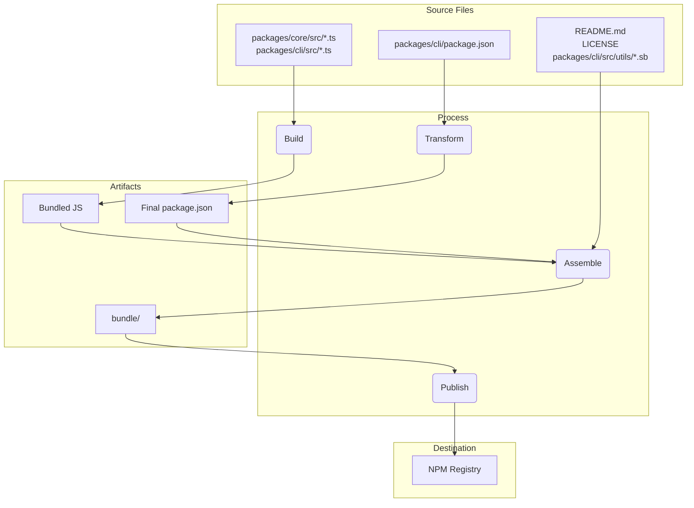

# 發布

## 發布週期與標籤

我們會盡可能嚴格遵循 https://semver.org/，但會在必須偏離時說明原因。我們的每週發布將是次版本增量，發布之間的任何錯誤修正或緊急修正將作為最新發布的修補版本發布。

### 預覽版

新的預覽版發布將在每週二 UTC 23:59 發布。這些發布尚未經過完全審查，可能包含回歸或其他未解決的問題。請協助我們測試並使用 `preview` 標籤安裝。

```bash
npm install -g @google/gemini-cli@preview
```

### 穩定版

- 新的穩定版發布將在每週二 UTC 20:00 發布，這將是上週發布的完整推廣加上任何錯誤修正和驗證。使用 `latest` 標籤。

```bash
npm install -g @google/gemini-cli@latest
```

### 每夜版

- 新版本將在每天 UTC 00:00 發布，這將是發布時主分支的所有變更。應假定有待驗證和問題。使用 `nightly` 標籤。

```bash
npm install -g @google/gemini-cli@nightly
```

# Release Process.

Where `x.y.z` is the next version to be released. In most all cases for the weekly release this will be an increment on `y`, aka minor version update. Major version updates `x` will need broader coordination and communication. For patches `z` see below. When possible we will do our best to adher to https://semver.org/

Our release cadence is new releases are sent to a preview channel for a week and then promoted to stable after a week. Version numbers will follow SemVer with weekly releases incrementing the minor version. Patches and bug fixes to both preview and stable releases will increment the patch version.

## Nightly Release

Each night at UTC 0000 we will auto deploy a nightly release from `main`. This will be a version of the next production release, x.y.z, with the nightly tag.

## Create Preview Release

Each Tuesday at UTC 2359 we will auto deploy a preview release of the next production release x.y.z.

- This will happen as a scheduled instance of the ‘release’ action. It will be cut off of Main.
- This will create a branch `release/vx.y.z-preview.n`
- We will run evals and smoke testing against this branch and the npm package. For now this should be manual smoke testing, we don't have a dedicated matrix or specific detailed process. There is work coming soon to make this more formalized and automatic see https://github.com/google-gemini/gemini-cli/issues/3788
- Users installing `@preview` will get this release as well

## Promote Stable Release

After one week (On the following Tuesday) with all signals a go, we will manually release at 2000 UTC via the current on-call person.

- The release action will be used with the source branch as `release/vx.y.z-preview.n`
- The version will be x.y.z
- The releaser will create and merge a pr into main with the version changes.
- Smoke tests and manual validation will be run. For now this should be manual smoke testing, we don't have a dedicated matrix or specific detailed process. There is work coming soon to make this more formalized and automatic see https://github.com/google-gemini/gemini-cli/issues/3788

## Patching Releases

If a critical bug needs to be fixed before the next scheduled release, follow this process to create a patch.

### 1. Create a Hotfix Branch

First, create a new branch for your fix. The source for this branch depends on whether you are patching a stable or a preview release.

- **For a stable release patch:**
  Create a branch from the Git tag of the version you need to patch. Tag names are formatted as `vx.y.z`.

  ```bash
  # Example: Create a hotfix branch for v0.2.0
  git checkout v0.2.0 -b hotfix/issue-123-fix-for-v0.2.0
  ```

- **For a preview release patch:**
  Create a branch from the existing preview release branch, which is formatted as `release/vx.y.z-preview.n`.

  ```bash
  # Example: Create a hotfix branch for a preview release
  git checkout release/v0.2.0-preview.0 && git checkout -b hotfix/issue-456-fix-for-preview
  ```

### 2. Implement the Fix

In your new hotfix branch, either create a new commit with the fix or cherry-pick an existing commit from the `main` branch. Merge your changes into the source of the hotfix branch (ex. https://github.com/google-gemini/gemini-cli/pull/6850).

### 3. Perform the Release

Follow the manual release process using the "Release" GitHub Actions workflow.

- **Version**: For stable patches, increment the patch version (e.g., `v0.2.0` -> `v0.2.1`). For preview patches, increment the preview number (e.g., `v0.2.0-preview.0` -> `v0.2.0-preview.1`).
- **Ref**: Use your source branch as the reference (ex. `release/v0.2.0-preview.0`)


### 4. Update Versions

After the hotfix is released, merge the changes back to the appropriate branch.

- **For a stable release hotfix:**
  Open a pull request to merge the release branch (e.g., `release/0.2.1`) back into `main`. This keeps the version number in `main` up to date.

- **For a preview release hotfix:**
  Open a pull request to merge the new preview release branch (e.g., `release/v0.2.0-preview.1`) back into the existing preview release branch (`release/v0.2.0-preview.0`) (ex. https://github.com/google-gemini/gemini-cli/pull/6868)

## Release Schedule

<table>
  <tr>
   <td>Date
   </td>
   <td>Stable UTC 2000
   </td>
   <td>Preview UTC 2359
   </td>
  </tr>
  <tr>
   <td>Aug 19th, 2025
   </td>
   <td>N/A
   </td>
   <td>0.2.0-preview.0
   </td>
  </tr>
  <tr>
   <td>Aug 26th, 2025
   </td>
   <td>0.2.0
   </td>
   <td>0.3.0-preview.0
   </td>
  </tr>
  <tr>
   <td>Sep 2nd, 2025
   </td>
   <td>0.3.0
   </td>
   <td>0.4.0-preview.0
   </td>
  </tr>
  <tr>
   <td>Sep 9th, 2025
   </td>
   <td>0.4.0
   </td>
   <td>0.5.0-preview.0
   </td>
  </tr>
  <tr>
   <td>Sep 16th, 2025
   </td>
   <td>0.5.0
   </td>
   <td>0.6.0-preview.0
   </td>
  </tr>
  <tr>
   <td>Sep 23rd, 2025
   </td>
   <td>0.6.0
   </td>
   <td>0.7.0-preview.0
   </td>
  </tr>
</table>

## 如何發布

發布透過 [release.yml](https://github.com/google-gemini/gemini-cli/actions/workflows/release.yml) GitHub Actions 工作流程管理。要執行修補或熱修復的手動發布：

1.  導覽到儲存庫的 **Actions** 標籤。
2.  從清單中選擇 **Release** 工作流程。
3.  點選 **Run workflow** 下拉按鈕。
4.  填入必要輸入：
    - **Version**：要發布的確切版本（例如，`v0.2.1`）。
    - **Ref**：要發布的分支或提交 SHA（預設為 `main`）。
    - **Dry Run**：保持 `true` 以測試工作流程而不發布，或設定為 `false` 以執行實際發布。
5.  點選 **Run workflow**。

### 簡要說明

每個發布，無論是自動化還是手動，都會執行以下步驟：

1.  從 `main` 分支檢出最新程式碼。
1.  安裝所有相依性。
1.  執行完整的 `preflight` 檢查和整合測試套件。
1.  如果所有測試成功，根據輸入計算下一個版本號。
1.  建立分支名稱 `release/${VERSION}`。
1.  建立標籤名稱 `v${VERSION}`。
1.  然後建置並發布套件到 npm，使用提供的版本號。
1.  最後，為版本建立 GitHub Release。

### 失敗處理

如果工作流程中的任何步驟失敗，它會自動在儲存庫中建立新問題，帶有 `bug` 和 `release-failure` 標籤。問題將包含失敗工作流程執行的連結，以便輕鬆偵錯。

### Docker

我們也執行名為 [release-docker.yml](../.gcp/release-docker.yml) 的 Google cloud build。它發布沙箱 docker 以配合您的發布。一旦服務帳戶權限整理好，這也會移至 GH 並與主要發布檔案合併。

## 發布驗證

推送新發布後，應執行煙霧測試以確保套件按預期運作。這可以透過在本機安裝套件並執行一系列測試來確保它們正常運作。

- `npx -y @google/gemini-cli@latest --version` 如果您不是在進行 rc 或 dev 標籤，用來驗證推送按預期運作
- `npx -y @google/gemini-cli@<release tag> --version` 用來驗證標籤適當推送
- _這在本機是破壞性的_ `npm uninstall @google/gemini-cli && npm uninstall -g @google/gemini-cli && npm cache clean --force &&  npm install @google/gemini-cli@<version>`
- 建議進行基本執行的煙霧測試，練習一些 llm 指令和工具，以確保套件按預期運作。我們會在未來將此編成規範。

## 本機測試與驗證：封裝和發布流程的變更

如果您需要測試發布流程而不實際發布到 NPM 或建立公開 GitHub 發布，您可以從 GitHub UI 手動觸發工作流程。

1.  前往儲存庫的 [Actions 標籤](https://github.com/google-gemini/gemini-cli/actions/workflows/release.yml)。
2.  點選「Run workflow」下拉選單。
3.  保持 `dry_run` 選項勾選（`true`）。
4.  點選「Run workflow」按鈕。

這將執行整個發布流程，但會跳過 `npm publish` 和 `gh release create` 步驟。您可以檢查工作流程日誌以確保一切按預期運作。

在提交之前，在本機測試封裝和發布流程的任何變更是至關重要的。這確保套件會正確發布，並且在使用者安裝時會按預期運作。

要驗證您的變更，您可以執行發布流程的試執行。這將模擬發布流程而不實際將套件發布到 npm 註冊表。

```bash
npm_package_version=9.9.9 SANDBOX_IMAGE_REGISTRY="registry" SANDBOX_IMAGE_NAME="thename" npm run publish:npm --dry-run
```

此指令將執行以下操作：

1.  建置所有套件。
2.  執行所有預發布腳本。
3.  建立將發布到 npm 的套件 tarball。
4.  列印將發布的套件摘要。

然後您可以檢查產生的 tarball，以確保它們包含正確的檔案且 `package.json` 檔案已正確更新。tarball 將在每個套件目錄的根目錄中建立（例如，`packages/cli/google-gemini-cli-0.1.6.tgz`）。

透過執行試執行，您可以確信您對封裝流程的變更是正確的，並且套件會成功發布。

## Release Deep Dive

The main goal of the release process is to take the source code from the packages/ directory, build it, and assemble a
clean, self-contained package in a temporary `bundle` directory at the root of the project. This `bundle` directory is what
actually gets published to NPM.

Here are the key stages:

Stage 1: Pre-Release Sanity Checks and Versioning

- What happens: Before any files are moved, the process ensures the project is in a good state. This involves running tests,
  linting, and type-checking (npm run preflight). The version number in the root package.json and packages/cli/package.json
  is updated to the new release version.
- Why: This guarantees that only high-quality, working code is released. Versioning is the first step to signify a new
  release.

Stage 2: Building the Source Code

- What happens: The TypeScript source code in packages/core/src and packages/cli/src is compiled into JavaScript.
- File movement:
  - packages/core/src/\*_/_.ts -> compiled to -> packages/core/dist/
  - packages/cli/src/\*_/_.ts -> compiled to -> packages/cli/dist/
- Why: The TypeScript code written during development needs to be converted into plain JavaScript that can be run by
  Node.js. The core package is built first as the cli package depends on it.

Stage 3: Assembling the Final Publishable Package

This is the most critical stage where files are moved and transformed into their final state for publishing. A temporary
`bundle` folder is created at the project root to house the final package contents.

1.  The `package.json` is Transformed:
    - What happens: The package.json from packages/cli/ is read, modified, and written into the root `bundle`/ directory.
    - File movement: packages/cli/package.json -> (in-memory transformation) -> `bundle`/package.json
    - Why: The final package.json must be different from the one used in development. Key changes include:
      - Removing devDependencies.
      - Removing workspace-specific "dependencies": { "@gemini-cli/core": "workspace:\*" } and ensuring the core code is
        bundled directly into the final JavaScript file.
      - Ensuring the bin, main, and files fields point to the correct locations within the final package structure.

2.  The JavaScript Bundle is Created:
    - What happens: The built JavaScript from both packages/core/dist and packages/cli/dist are bundled into a single,
      executable JavaScript file.
    - File movement: packages/cli/dist/index.js + packages/core/dist/index.js -> (bundled by esbuild) -> `bundle`/gemini.js (or a
      similar name).
    - Why: This creates a single, optimized file that contains all the necessary application code. It simplifies the package
      by removing the need for the core package to be a separate dependency on NPM, as its code is now included directly.

3.  Static and Supporting Files are Copied:
    - What happens: Essential files that are not part of the source code but are required for the package to work correctly
      or be well-described are copied into the `bundle` directory.
    - File movement:
      - README.md -> `bundle`/README.md
      - LICENSE -> `bundle`/LICENSE
      - packages/cli/src/utils/\*.sb (sandbox profiles) -> `bundle`/
    - Why:
      - The README.md and LICENSE are standard files that should be included in any NPM package.
      - The sandbox profiles (.sb files) are critical runtime assets required for the CLI's sandboxing feature to
        function. They must be located next to the final executable.

Stage 4: Publishing to NPM

- What happens: The npm publish command is run from inside the root `bundle` directory.
- Why: By running npm publish from within the `bundle` directory, only the files we carefully assembled in Stage 3 are uploaded
  to the NPM registry. This prevents any source code, test files, or development configurations from being accidentally
  published, resulting in a clean and minimal package for users.

Summary of File Flow



This process ensures that the final published artifact is a purpose-built, clean, and efficient representation of the
project, rather than a direct copy of the development workspace.
