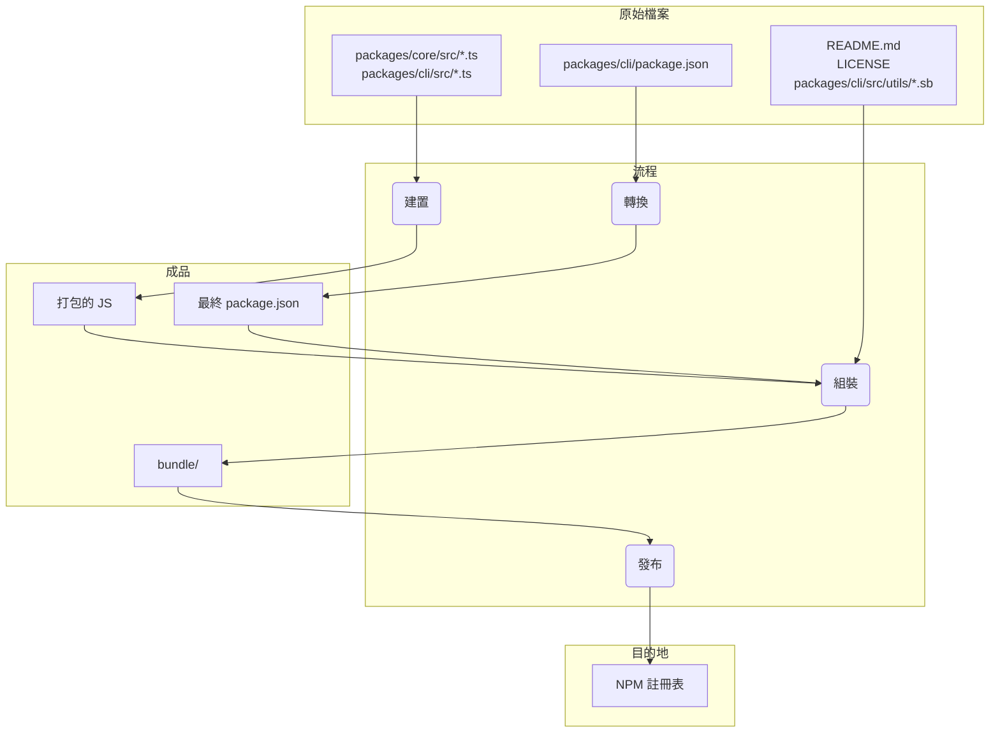

# 發布

## 發布週期與標籤

我們會盡可能嚴格遵循 https://semver.org/，但會在必須偏離時說明原因。我們的每週發布將是次版本增量，發布之間的任何錯誤修正或緊急修正將作為最新發布的修補版本發布。

### 預覽版

新的預覽版發布將在每週二 UTC 23:59 發布。這些發布尚未經過完全審查，可能包含回歸或其他未解決的問題。請協助我們測試並使用 `preview` 標籤安裝。

```bash
npm install -g @google/gemini-cli@preview
```

### 穩定版

- 新的穩定版發布將在每週二 UTC 20:00 發布，這將是上週發布的完整推廣加上任何錯誤修正和驗證。使用 `latest` 標籤。

```bash
npm install -g @google/gemini-cli@latest
```

### 每夜版

- 新版本將在每天 UTC 00:00 發布，這將是發布時主分支的所有變更。應假定有待驗證和問題。使用 `nightly` 標籤。

```bash
npm install -g @google/gemini-cli@nightly
```

# 發布程序

其中 `x.y.z` 是下一個要發布的版本。在大多數週版本發布情況下，這將是 `y` 的遞增，即次版本更新。主版本更新 `x` 將需要更廣泛的協調和溝通。對於修補程式 `z`，請參閱下方。在可能的情況下，我們會盡力遵循 https://semver.org/

我們的發布節奏是新版本先傳送到預覽頻道一週，然後在一週後推廣到穩定版。版本號將遵循 SemVer，週版本遞增次版本。對預覽版和穩定版的修補程式和錯誤修正將遞增修補版本。

## 每夜版發布

每天 UTC 0000 我們會從 `main` 自動部署每夜版發布。這將是下一個正式版 x.y.z 的版本，帶有 nightly 標籤。

## 建立預覽版發布

每週二 UTC 23:59 我們會自動部署下一個正式版 x.y.z 的預覽版發布。

- 這將發生作為 'release' 動作的排程實例。它將從 Main 分支切出。
- 這將建立分支 `release/vx.y.z-preview.n`
- 我們將針對此分支和 npm 套件執行評估和煙霧測試。目前這應該是手動煙霧測試，我們還沒有專門的矩陣或特定的詳細流程。即將有工作讓這更正式化和自動化，請參閱 https://github.com/google-gemini/gemini-cli/issues/3788
- 安裝 `@preview` 的使用者也會獲得此發布

## 推廣穩定版發布

經過一週後（在接下來的週二），所有信號都正常，我們將在 UTC 20:00 透過目前值班人員手動發布。

- 發布動作將使用並以 `release/vx.y.z-preview.n` 作為來源分支
- 版本將是 x.y.z
- 發布者將建立並合併拉取請求到主分支，包含版本變更。
- 將執行煙霧測試和手動驗證。目前這應該是手動煙霧測試，我們還沒有專門的矩陣或特定的詳細流程。即將有工作讓這更正式化和自動化，請參閱 https://github.com/google-gemini/gemini-cli/issues/3788

## 修補發布

如果關鍵錯誤需要修正在下次排程發布前，請遵循此流程建立修補程式。

### 1. 建立熱修復分支

首先，建立新分支供您修正使用。此分支的來源取決於您是要修補穩定版還是預覽版發布。

- **對於穩定版發布修補：**
  從您需要修補的版本的 Git 標籤建立分支。標籤名稱格式為 `vx.y.z`。

  ```bash
  # 範例：建立熱修復分支 for v0.2.0
  git checkout v0.2.0 -b hotfix/issue-123-fix-for-v0.2.0
  ```

- **對於預覽版發布修補：**
  從現有的預覽版發布分支建立，其格式為 `release/vx.y.z-preview.n`。

  ```bash
  # 範例：建立預覽版發布的熱修復分支
  git checkout release/v0.2.0-preview.0 && git checkout -b hotfix/issue-456-fix-for-preview
  ```

### 2. 實作修正

在您的新熱修復分支中，建立新提交包含修正或從 `main` 分支挑選現有提交。將您的變更合併到熱修復分支的來源（例如 https://github.com/google-gemini/gemini-cli/pull/6850）。

### 3. 執行發布

使用 "Release" GitHub Actions 工作流程遵循手動發布流程。

- **版本**：對於穩定版修補，遞增修補版本（例如，`v0.2.0` -> `v0.2.1`）。對於預覽版修補，遞增預覽編號（例如，`v0.2.0-preview.0` -> `v0.2.0-preview.1`）。
- **參考**：使用您的來源分支作為參考（例如 `release/v0.2.0-preview.0`）


### 4. 更新版本

熱修復發布後，將變更合併回適當的分支。

- **對於穩定版發布熱修復：**
  開啟拉取請求合併發布分支（例如，`release/0.2.1`）回到 `main`。這保持 `main` 中的版本號為最新。

- **對於預覽版發布熱修復：**
  開啟拉取請求將新的預覽版發布分支（例如，`release/v0.2.0-preview.1`）合併回現有的預覽版發布分支（`release/v0.2.0-preview.0`）（例如 https://github.com/google-gemini/gemini-cli/pull/6868）

## 發布排程

<table>
  <tr>
   <td>Date
   </td>
   <td>Stable UTC 2000
   </td>
   <td>Preview UTC 2359
   </td>
  </tr>
  <tr>
   <td>Aug 19th, 2025
   </td>
   <td>N/A
   </td>
   <td>0.2.0-preview.0
   </td>
  </tr>
  <tr>
   <td>Aug 26th, 2025
   </td>
   <td>0.2.0
   </td>
   <td>0.3.0-preview.0
   </td>
  </tr>
  <tr>
   <td>Sep 2nd, 2025
   </td>
   <td>0.3.0
   </td>
   <td>0.4.0-preview.0
   </td>
  </tr>
  <tr>
   <td>Sep 9th, 2025
   </td>
   <td>0.4.0
   </td>
   <td>0.5.0-preview.0
   </td>
  </tr>
  <tr>
   <td>Sep 16th, 2025
   </td>
   <td>0.5.0
   </td>
   <td>0.6.0-preview.0
   </td>
  </tr>
  <tr>
   <td>Sep 23rd, 2025
   </td>
   <td>0.6.0
   </td>
   <td>0.7.0-preview.0
   </td>
  </tr>
</table>

## 如何發布

發布透過 [release.yml](https://github.com/google-gemini/gemini-cli/actions/workflows/release.yml) GitHub Actions 工作流程管理。要執行修補或熱修復的手動發布：

1.  導覽到儲存庫的 **Actions** 標籤。
2.  從清單中選擇 **Release** 工作流程。
3.  點選 **Run workflow** 下拉按鈕。
4.  填入必要輸入：
    - **Version**：要發布的確切版本（例如，`v0.2.1`）。
    - **Ref**：要發布的分支或提交 SHA（預設為 `main`）。
    - **Dry Run**：保持 `true` 以測試工作流程而不發布，或設定為 `false` 以執行實際發布。
5.  點選 **Run workflow**。

### 簡要說明

每個發布，無論是自動化還是手動，都會執行以下步驟：

1.  從 `main` 分支檢出最新程式碼。
1.  安裝所有相依性。
1.  執行完整的 `preflight` 檢查和整合測試套件。
1.  如果所有測試成功，根據輸入計算下一個版本號。
1.  建立分支名稱 `release/${VERSION}`。
1.  建立標籤名稱 `v${VERSION}`。
1.  然後建置並發布套件到 npm，使用提供的版本號。
1.  最後，為版本建立 GitHub Release。

### 失敗處理

如果工作流程中的任何步驟失敗，它會自動在儲存庫中建立新問題，帶有 `bug` 和 `release-failure` 標籤。問題將包含失敗工作流程執行的連結，以便輕鬆偵錯。

### Docker

我們也執行名為 [release-docker.yml](../.gcp/release-docker.yml) 的 Google cloud build。它發布沙箱 docker 以配合您的發布。一旦服務帳戶權限整理好，這也會移至 GH 並與主要發布檔案合併。

## 發布驗證

推送新發布後，應執行煙霧測試以確保套件按預期運作。這可以透過在本機安裝套件並執行一系列測試來確保它們正常運作。

- `npx -y @google/gemini-cli@latest --version` 如果您不是在進行 rc 或 dev 標籤，用來驗證推送按預期運作
- `npx -y @google/gemini-cli@<release tag> --version` 用來驗證標籤適當推送
- _這在本機是破壞性的_ `npm uninstall @google/gemini-cli && npm uninstall -g @google/gemini-cli && npm cache clean --force &&  npm install @google/gemini-cli@<version>`
- 建議進行基本執行的煙霧測試，練習一些 llm 指令和工具，以確保套件按預期運作。我們會在未來將此編成規範。

## 本機測試與驗證：封裝和發布流程的變更

如果您需要測試發布流程而不實際發布到 NPM 或建立公開 GitHub 發布，您可以從 GitHub UI 手動觸發工作流程。

1.  前往儲存庫的 [Actions 標籤](https://github.com/google-gemini/gemini-cli/actions/workflows/release.yml)。
2.  點選「Run workflow」下拉選單。
3.  保持 `dry_run` 選項勾選（`true`）。
4.  點選「Run workflow」按鈕。

這將執行整個發布流程，但會跳過 `npm publish` 和 `gh release create` 步驟。您可以檢查工作流程日誌以確保一切按預期運作。

在提交之前，在本機測試封裝和發布流程的任何變更是至關重要的。這確保套件會正確發布，並且在使用者安裝時會按預期運作。

要驗證您的變更，您可以執行發布流程的試執行。這將模擬發布流程而不實際將套件發布到 npm 註冊表。

```bash
npm_package_version=9.9.9 SANDBOX_IMAGE_REGISTRY="registry" SANDBOX_IMAGE_NAME="thename" npm run publish:npm --dry-run
```

此指令將執行以下操作：

1.  建置所有套件。
2.  執行所有預發布腳本。
3.  建立將發布到 npm 的套件 tarball。
4.  列印將發布的套件摘要。

然後您可以檢查產生的 tarball，以確保它們包含正確的檔案且 `package.json` 檔案已正確更新。tarball 將在每個套件目錄的根目錄中建立（例如，`packages/cli/google-gemini-cli-0.1.6.tgz`）。

透過執行試執行，您可以確信您對封裝流程的變更是正確的，並且套件會成功發布。

## 發布深入探討

發布流程的主要目標是從 packages/ 目錄取得原始碼，建置它，並在專案根目錄的臨時 `bundle` 目錄中組裝一個乾淨、自包含的套件。這個 `bundle` 目錄就是實際發布到 NPM 的內容。

以下是關鍵階段：

階段 1：發布前完整性檢查與版本控制

- 發生什麼：在移動任何檔案之前，流程確保專案處於良好狀態。這包括執行測試、程式碼檢查和類型檢查（npm run preflight）。根目錄 package.json 和 packages/cli/package.json 的版本號會更新為新的發布版本。
- 為什麼：這保證只有高品質、可運作的程式碼會被發布。版本控制是表示新發布的第一步。

階段 2：建置原始碼

- 發生什麼：packages/core/src 和 packages/cli/src 中的 TypeScript 原始碼會編譯成 JavaScript。
- 檔案移動：
  - packages/core/src/\*_/_.ts -> 編譯到 -> packages/core/dist/
  - packages/cli/src/\*_/_.ts -> 編譯到 -> packages/cli/dist/
- 為什麼：開發過程中撰寫的 TypeScript 程式碼需要轉換成可由 Node.js 執行的純 JavaScript。核心套件會先建置，因為 cli 套件依賴它。

階段 3：組裝最終可發布套件

這是最關鍵的階段，檔案會被移動和轉換到最終發布狀態。在專案根目錄建立臨時 `bundle` 資料夾來存放最終套件內容。

1.  轉換 `package.json`：
    - 發生什麼：從 packages/cli/ 讀取 package.json，修改後寫入根目錄 `bundle`/ 目錄。
    - 檔案移動：packages/cli/package.json -> （記憶體中轉換）-> `bundle`/package.json
    - 為什麼：最終的 package.json 必須與開發時使用的不同。主要變更包括：
      - 移除 devDependencies。
      - 移除工作區特定的 "dependencies": { "@gemini-cli/core": "workspace:\*" } 並確保核心程式碼直接打包到最終 JavaScript 檔案中。
      - 確保 bin、main 和 files 欄位指向最終套件結構中的正確位置。

2.  建立 JavaScript 組合包：
    - 發生什麼：來自 packages/core/dist 和 packages/cli/dist 的已建置 JavaScript 會打包成單一、可執行的 JavaScript 檔案。
    - 檔案移動：packages/cli/dist/index.js + packages/core/dist/index.js -> （由 esbuild 打包）-> `bundle`/gemini.js（或類似名稱）。
    - 為什麼：這建立了包含所有必要應用程式碼的單一最佳化檔案。它透過移除核心套件作為 NPM 上獨立相依性的需求來簡化套件，因為其程式碼現在直接包含在內。

3.  複製靜態和支援檔案：
    - 發生什麼：不屬於原始碼但套件正常運作或良好描述所需的基本檔案會複製到 `bundle` 目錄。
    - 檔案移動：
      - README.md -> `bundle`/README.md
      - LICENSE -> `bundle`/LICENSE
      - packages/cli/src/utils/\*.sb（沙箱設定檔）-> `bundle`/
    - 為什麼：
      - README.md 和 LICENSE 是任何 NPM 套件都應該包含的標準檔案。
      - 沙箱設定檔（.sb 檔案）是 CLI 沙箱化功能運作所需的關鍵執行時資產。它們必須位於最終可執行檔旁邊。

階段 4：發布到 NPM

- 發生什麼：從根目錄 `bundle` 目錄內執行 npm publish 指令。
- 為什麼：透過從 `bundle` 目錄內執行 npm publish，只有我們在階段 3 中仔細組裝的檔案會上傳到 NPM 註冊表。這防止任何原始碼、測試檔案或開發設定被意外發布，為使用者提供乾淨且最小的套件。

檔案流程摘要



這個流程確保最終發布的成品是專案的專用建置、乾淨且高效的表示，而不是開發工作區的直接副本。
